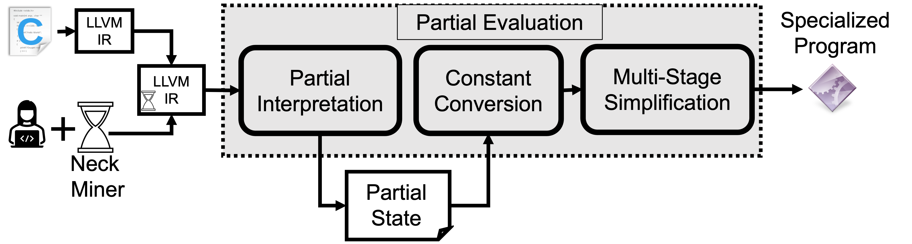

# LMCAS Approach #

<p align="center">

</p>

# LMCAS Paper
You can find the paper that describes the details of LMCAS [HERE](https://arxiv.org/abs/2109.02775)

```
@misc{alhanahnah2021lightweight,
      title={Lightweight, Multi-Stage, Compiler-Assisted Application Specialization}, 
      author={Mohannad Alhanahnah and Rithik Jain and Vaibhav Rastogi and Somesh Jha and Thomas Reps},
      year={2021},
      eprint={2109.02775},
      archivePrefix={arXiv},
      primaryClass={cs.SE}
}
```

# LMCAS Source Code
The implementation of LMCAS is unavaiable, we are working on licensing aspect to open source it.

# Building LMCAS Docker Machine
Execute the following commands to build and run LMCAS demo. The build process takes sometime because it involves downloading and building both of LLVM and KLEE.  
```shell
cd LMCAS_Docker
docker build -t lmcas_tutorial .
docker run -it lmcas_tutorial
```
# LMCAS Artifacts
We provide the source code of the apps used in the evaluation `after adding the neck`, which is indicated through the special function call `klee_dump_memory` (i.e., in `wc` the neck is [HERE](https://github.com/Mohannadcse/LMCAS_Demo/blob/main/LMCAS_tutorial/source_code_files/wc.c#L746)). But you need to compile these programs using `wllvm`. To avoid compilation, we also provided the bitcode of these apps. The bitcode of the apps can be found under the directory [LMCAS_tutorial/bitcode_files](LMCAS_tutorial/bitcode_files).

# LMCAS Demo

[](https://youtu.be/4SOxZEBenAw)

# Running LMCAS
For debloating the artifacts using LMCAS, you need to use the script `runDemo.sh` as follows:

`./runDemo.sh --file:<location/to/bitcodefile> --args:<supplied arguments>`

Our debloating strategy relies on the fact that we can split the app into configuration part and main logic part. Therefore, the specialized programs are generated w.r.t the required functionality. For example, you want `wc` to only count number of lines i.e., `wc -l`. So you don't need to provide the file name to our script for example:
```
./runDemo.sh --file:wc.bc      --args:-l
./runDemo.sh --file:tcpdump.bc --args:"-i lo"
```

>:warning: **double quotation** is required if you want to pass more than one argument.

After running the analysis, a new directory will be created that contains all results belong to the debloated app. The directory name starts with `debloate_<bitcodefile>`.

For replicating our evaluation, you can run the analysis according to the settings mentioned in this [TABLE](https://sites.google.com/view/lmcas/home#h.r7u6w8uktrgc)

# Interpreting the Results
After running `LMCAS`, a directory will be created `debloate_<bitcodefile>`. This directory contains a set of files that are generated while debloating the app. 

+ Files appended with `_cc`: represent the outcome of the constant conversion
+ Files appended with `_cp`: represent the outcome of the constant propagation
+ Files appended with `_ps`: represent the outcome of the path simplification
+ Files appended with `_cu`: represent the outcome of the cleaning up. These files are the final outcome and represent the specialized app. Therefore, your testing should be conducted on this file.
+ report.csv: contains profiling information summary about different statistics after finishing each simplification step. 

+ statistics: our script also generates in the terminal some statistics describe the reduction rate in the size and gadgets after debloating. 

<p align="center">

</p>

We also generate a historgram (`tcpdump_reductions.png`) for illustrating the reduction rates presented in the terminal as shown below: 

<p align="center">

</p>

# Testing the specialized app
For testing the specialized app generated by our tool, you just need to run the executable ends with `_cu`, but you don't need to provide the entire arguments. Specifically, you don't need to provide the supplied inputs in the debloating process. For example, to run the debloated `wc_cu`, you just need to provide the file name, because the line count option `-l` is already supplied to our debloating script script `runDemo.sh`. According to the previous examples, for testing `wc -l` and `tcpdump -i lo`:

```
./wc_cu <filename>
./tcpdump_cu
```

# Contact
For more information, contact Mohannad Alhanahnah ([@MAlhanahnah](https://twitter.com/MAlhanahnah))


